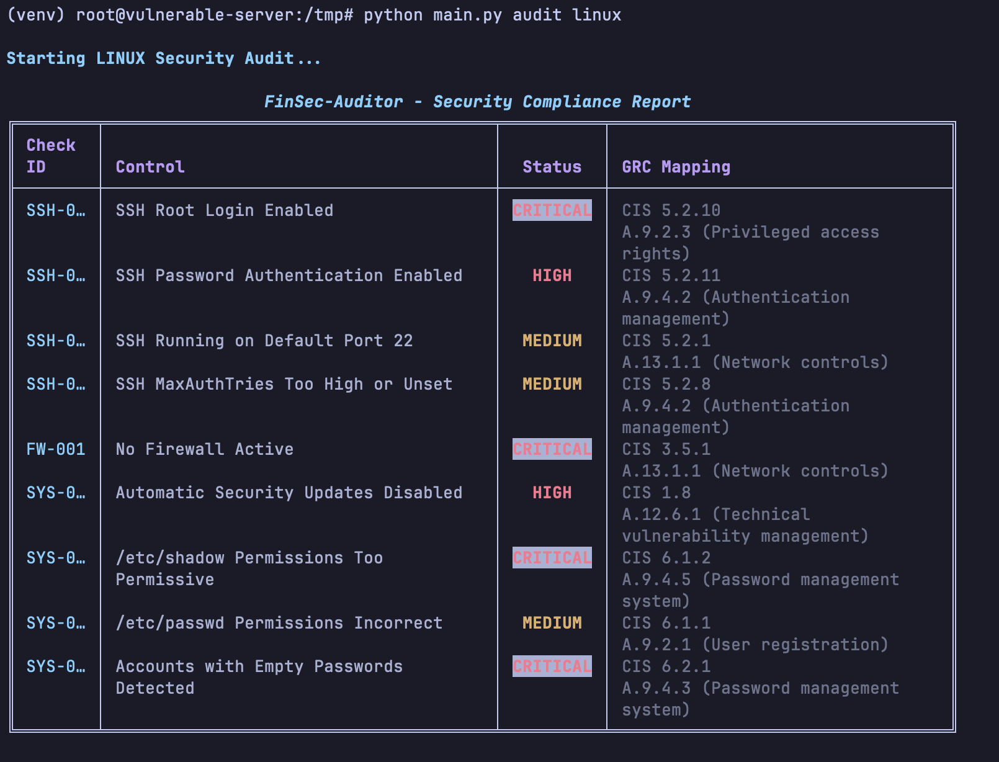
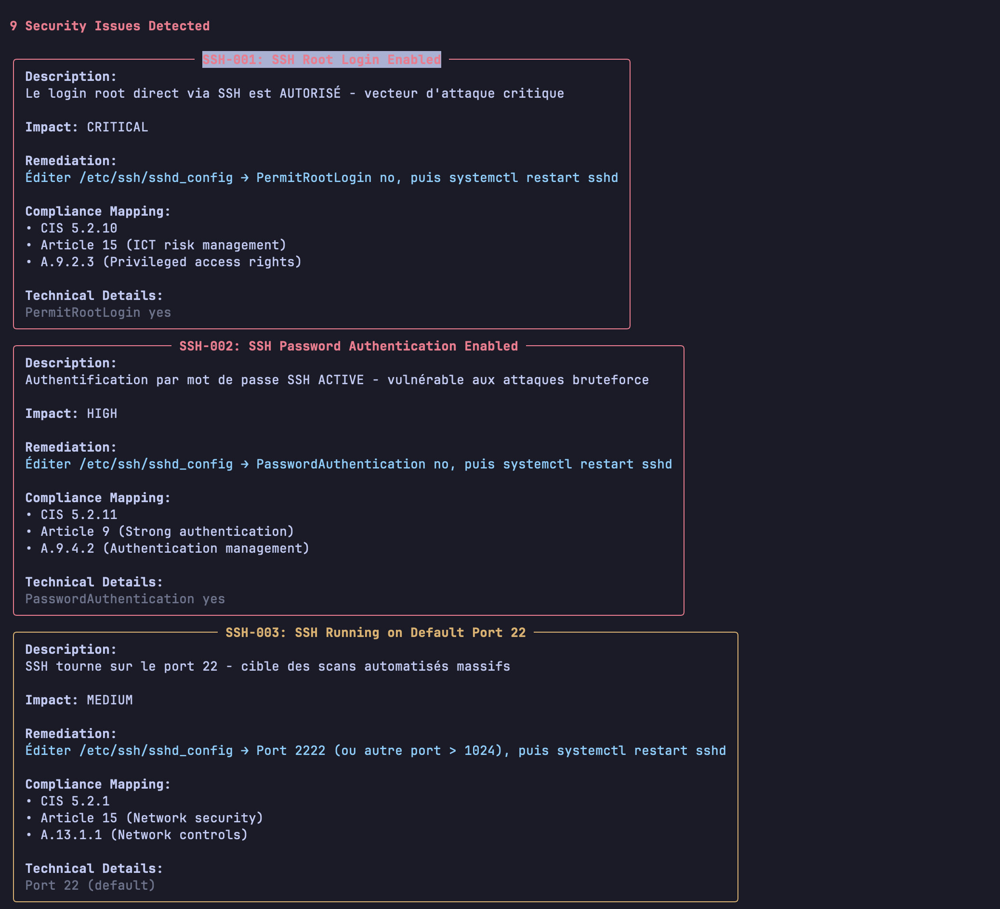
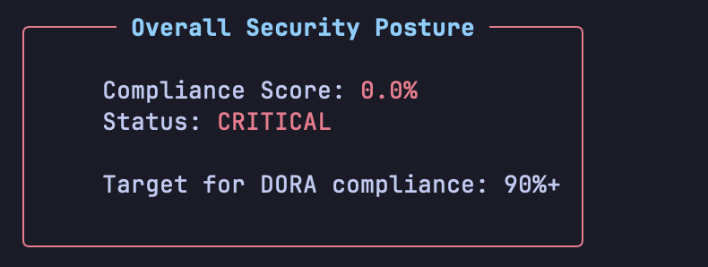
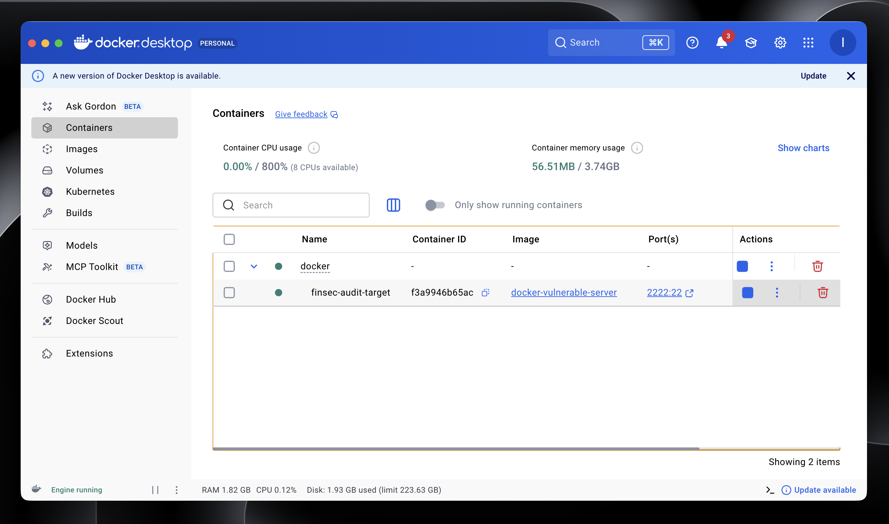

# FinSec-Auditor

Outil CLI d'audit de sécurité automatisé pour le secteur financier, aligné sur les standards **DORA**, **CIS Benchmarks** et **ISO 27001**.

## Présentation

FinSec-Auditor est un outil Python qui automatise les audits de conformité sécurité pour les infrastructures Linux. Il exécute des checks de hardening et mappe chaque vulnérabilité détectée aux frameworks réglementaires clés du secteur financier.

**Problème adressé :**  
Les audits de conformité manuels sont chronophages, sujets à erreurs et ne passent pas à l'échelle. Vérifier manuellement les configurations SSH, les règles firewall et les permissions fichiers sur des dizaines ou centaines de serveurs représente plusieurs jours de travail répétitif.

**Solution apportée :**  
Automatisation complète des checks de sécurité avec scoring de conformité instantané et remediation guidée pour chaque finding.

## Fonctionnalités

### Audits Linux (Phase 1)

**Sécurité SSH**
- Détection du login root direct (PermitRootLogin)
- Vérification de l'authentification par mot de passe vs clés SSH
- Analyse du port SSH (détection port par défaut 22)
- Contrôle MaxAuthTries (limite tentatives d'authentification)

**Firewall**
- Détection UFW actif/inactif
- Analyse des règles iptables

**Hardening système**
- Vérification unattended-upgrades (mises à jour automatiques)
- Contrôle permissions /etc/shadow (hachages mots de passe)
- Contrôle permissions /etc/passwd
- Détection comptes sans mot de passe

**Mapping GRC**  
Chaque finding est automatiquement mappé sur :
- **CIS Benchmarks** (ex: CIS 5.2.10, CIS 6.1.2)
- **DORA** (Digital Operational Resilience Act - Articles 8, 9, 11, 15)
- **ISO 27001** (ex: A.9.2.3, A.13.1.1)

## Installation

### Prérequis

- Python 3.9 ou supérieur
- pip et venv
- Droits sudo (pour checks système complets)

### Installation standard

```bash
git clone https://github.com/clerctom/finsec-auditor.git
cd finsec-auditor
python3 -m venv venv
source venv/bin/activate
pip install -r requirements.txt
```

## Utilisation

### Lancement rapide

```bash
# Avec droits sudo (audit complet)
sudo venv/bin/python main.py audit linux

# Sans sudo (audit partiel)
python main.py audit linux

# Ou via le script helper
./run_audit.sh
```

### Exemples de sortie


*Tableau récapitulatif avec sévérités color-codées (CRITICAL, HIGH, MEDIUM)*


*Détails des vulnérabilités avec remediation guidée*


*Score de conformité calculé (pourcentage de checks réussis)*

## Tests avec Docker

Un container Docker intentionnellement vulnérable est fourni pour tester l'outil sans impacter votre système.

### Lancement du container de test

```bash
cd docker
docker-compose up -d
```


*Container vulnérable prêt pour l'audit*

### Audit du container

```bash
# Revenir au dossier racine
cd ..

# Copier les fichiers dans le container
docker cp auditors finsec-audit-target:/tmp/
docker cp main.py finsec-audit-target:/tmp/

# Lancer l'audit dans le container
docker exec -it finsec-audit-target bash -c "cd /tmp && python3 main.py audit linux"
```

**Vulnérabilités attendues dans le container :**
- Root login SSH activé
- Authentification par mot de passe SSH active
- Pas de firewall actif
- /etc/shadow en permissions 644 (lisible par tous)
- Compte utilisateur sans mot de passe
- Pas de mises à jour automatiques
- SSH sur port par défaut 22
- MaxAuthTries trop élevé

### Nettoyage

```bash
docker-compose down
```

## Stack technique

| Composant | Usage |
|-----------|-------|
| Python 3.9+ | Langage principal avec type hints |
| Click | Framework CLI avec parsing arguments |
| Rich | Interface terminal (tableaux, couleurs, panels) |
| Subprocess | Exécution commandes système pour checks |
| Dataclasses | Modélisation des findings |

## Architecture

```
finsec-auditor/
├── main.py              # Point d'entrée CLI + affichage Rich
├── auditors/
│   ├── __init__.py
│   ├── linux.py         # Checks Linux hardening (Phase 1)
│   └── aws.py           # Checks AWS (Phase 2 - à venir)
├── docker/
│   ├── Dockerfile.vulnerable
│   └── docker-compose.yml
├── Images/              # Screenshots documentation
├── requirements.txt
├── run_audit.sh
└── README.md
```

**Principes de conception :**
- Modularité : chaque plateforme (Linux, AWS, K8s) = module séparé
- Structure Finding standardisée pour tous les checks
- Mapping GRC systématique dès la conception
- Output terminal professionnel avec Rich

## Roadmap de mon projet

### Phase 1 : Linux Hardening (Complète)
- Checks SSH, firewall, système
- Mapping CIS + DORA + ISO 27001
- Output Rich terminal
- Container Docker de test

### Phase 2 : AWS Security (À venir)
- Audits IAM (root MFA, rotation clés, politiques)
- Audits S3 (buckets publics, chiffrement, versioning)
- Audits EC2/VPC (security groups, flow logs)
- Mapping contrôles cloud DORA Article 15

### Phase 3 : Reporting avancé
- Export JSON (`--json`)
- Génération rapports HTML (`--html`)
- Export CSV pour tableurs
- Tracking historique compliance

### Phase 4 : Plateformes additionnelles
- Kubernetes (RBAC, Pod Security)
- Conteneurs Docker
- Bases de données (PostgreSQL, MySQL)

## Couverture Compliance

| Catégorie | CIS Benchmark | DORA | ISO 27001 |
|-----------|---------------|------|-----------|
| SSH Hardening | 5.2.x | Article 15 | A.9.4.2, A.9.2.3 |
| Firewall | 3.5.1 | Article 15 | A.13.1.1 |
| Patch Management | 1.8 | Article 11 | A.12.6.1 |
| Permissions fichiers | 6.1.x | Article 8 | A.9.4.5 |
| Comptes utilisateurs | 6.2.x | Article 9 | A.9.4.3 |

**Cible DORA :** 90%+ de conformité pour les entités financières critiques.

## Limitations connues actuel

- Nécessite Linux (Debian/Ubuntu testé, RHEL/CentOS à valider)
- Certains checks requièrent droits sudo
- Pas de support Windows/macOS pour audits système
- Phase AWS non implémentée (prévue Q1 2026)

## Avertissement

**Usage autorisé uniquement.**

Cet outil est conçu pour auditer des systèmes dont vous êtes propriétaire ou pour lesquels vous avez une autorisation explicite.

- Utilisation autorisée : infrastructures personnelles, environnements de test, audits contractuels
- Utilisation interdite : scan non autorisé, systèmes tiers sans permission

Le container Docker vulnérable est intentionnellement non-sécurisé. Ne jamais le déployer en production ou l'exposer sur internet.

## Auteur

**Tom Clerc**  
Étudiant en cybersécurité

Contact : tom.clerc@epitech.eu

GitHub: [@clerctom](https://github.com/CLERC-Tom)

*Projet développé pour démontrer des compétences en automatisation sécurité et conformité réglementaire.*